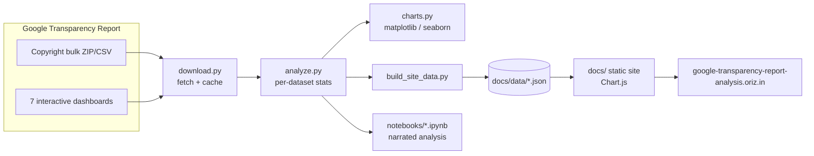

# Google Transparency Report Analysis

> Independent, reproducible data analysis and visualization of Google's complete Transparency Report.

[](./LICENSE)
[](https://github.com/chirag127/google-transparency-report-analysis/stargazers)
[](https://github.com/chirag127/google-transparency-report-analysis/commits)
[](https://github.com/chirag127/google-transparency-report-analysis/actions)


## What it is / why it exists

Google publishes eight Transparency Report datasets covering copyright removals, government requests, encryption adoption, unsafe browsing, and more — but the data is scattered across interactive dashboards and one massive bulk CSV, making cross-dataset trends hard to see. This project pulls that data together, runs reproducible analysis in Python, and renders a clean editorial data-viz site so anyone can explore what Google actually reports about censorship, surveillance, and web safety over time.

It is an independent project and is **not affiliated with Google**.

## Links

- **Live site:** https://google-transparency-report-analysis.oriz.in
- **Landing page:** https://google-transparency-report-analysis.oriz.in
- **Repository:** https://github.com/chirag127/google-transparency-report-analysis

> ⭐ If this is useful, please star the repo — it helps others find it.

## Architecture / data flow



## Features

- Registry of all **8 Google Transparency Report datasets** in one place (`datasets.py`).
- Full programmatic analysis of the **Copyright Removals** bulk dataset (500M+ URLs).
- Cached downloads so re-runs don't re-fetch large files.
- Reusable matplotlib/seaborn chart helpers with a consistent editorial palette.
- JSON export pipeline that feeds a static, dependency-light data-viz site (Chart.js).
- Narrated Jupyter notebooks for the master analysis and copyright deep-dive.
- CLI for download + analysis + site-data export.
- Test suite: registry integrity, mocked-HTTP caching, chart smoke tests, and Playwright e2e that loads every page.

## Key findings

- 500M+ URLs requested for copyright removal since 2011; removal rate ~90%.
- Government content-removal requests grew ~10x from 2011 to 2023.
- Top-1000 website HTTPS adoption climbed from 48% (2015) to 96% (2023).
- 1M+ EU Right to be Forgotten URLs evaluated; ~46% delisted.
- Phishing sites now outnumber malware sites ~10:1 in Safe Browsing data.

## Tech stack

- **Language:** Python 3.12+
- **Analysis:** pandas, matplotlib, seaborn, requests
- **Notebooks:** Jupyter, ipykernel, nbformat
- **Site:** static HTML + Chart.js (no framework build step)
- **Testing:** pytest, Playwright (e2e)
- **Packaging:** setuptools (`gtra` package, `src/` layout)
- **CI:** GitHub Actions (pytest, e2e, MegaLinter)

## Repo structure

```
src/gtra/
  datasets.py          registry of all 8 datasets
  download.py          fetch + cache bulk datasets
  analyze.py           per-dataset analysis + CLI (python -m gtra.analyze)
  charts.py            reusable matplotlib/seaborn helpers
  build_site_data.py   export findings as JSON to docs/data/
notebooks/
  google-transparency-report-analysis.ipynb   master notebook
  copyright-removals-analysis.ipynb            copyright deep-dive
docs/                  static data-viz site (deployed to *.oriz.in)
  index.html + per-dataset pages (copyright, government-removals, https, ...)
  assets/              style.css (editorial blue/teal) + app.js (Chart.js)
tests/
  test_datasets.py     registry integrity
  test_download.py     caching logic (mocked HTTP)
  test_analyze.py      chart smoke tests + JSON schema
  e2e/                 Playwright — every page loads, charts render
.github/workflows/     ci.yml · e2e.yml · deploy.yml · megalinter.yml
```

## Quick start

### Notebook

```bash
git clone https://github.com/chirag127/google-transparency-report-analysis.git
cd google-transparency-report-analysis
pip install -r requirements.txt
pip install -e .
jupyter notebook notebooks/google-transparency-report-analysis.ipynb
```

### CLI

```bash
pip install -r requirements.txt && pip install -e .

# Download + analyze the copyright dataset
python -m gtra.analyze --dataset copyright --download --report

# All datasets (stubs for non-bulk)
python -m gtra.analyze --dataset all --report

# Export JSON for the site
python -m gtra.build_site_data
```

### Tests

```bash
pip install -r requirements-dev.txt
pytest tests/ --ignore=tests/e2e -v

# E2E (serve docs/ first)
cd docs && python -m http.server 8080 &
pytest tests/e2e/ -v
```

## Data sources

All data comes from Google's official [Transparency Report](https://transparencyreport.google.com). The data is public; this project is independent and not affiliated with Google.

| Dataset | Source |
|---|---|
| Copyright Removals (Web Search) | Bulk CSV — full programmatic analysis |
| Government Requests to Remove Content | Interactive report |
| Government Requests for User Information | Interactive report |
| HTTPS Encryption in Transit | Interactive report |
| Safe Browsing — Unsafe Sites | Interactive report |
| Email Encryption in Transit | Interactive report |
| EU Right to be Forgotten | Interactive report |
| Traffic Disruptions | Interactive report |

## Part of the oriz family

One of ~80 sites in the [oriz](https://blog.oriz.in) family — small, focused tools and analyses shipped independently. See the blog at [blog.oriz.in](https://blog.oriz.in).

## Cost

Hosting runs **$0 on the Cloudflare free tier**.

## Contributing

Issues and PRs welcome. Add a new dataset by extending the registry in `src/gtra/datasets.py`, wire analysis into `analyze.py`, and add a page under `docs/`. Run `pytest` before opening a PR.

## Status

Stable for the copyright dataset (full analysis) and the site; the remaining datasets ship as interactive-report summaries with room to deepen. Conventional commits are the changelog.

## License

[MIT](./LICENSE) © Chirag Singhal

## Author

Chirag Singhal — chirag@oriz.in
